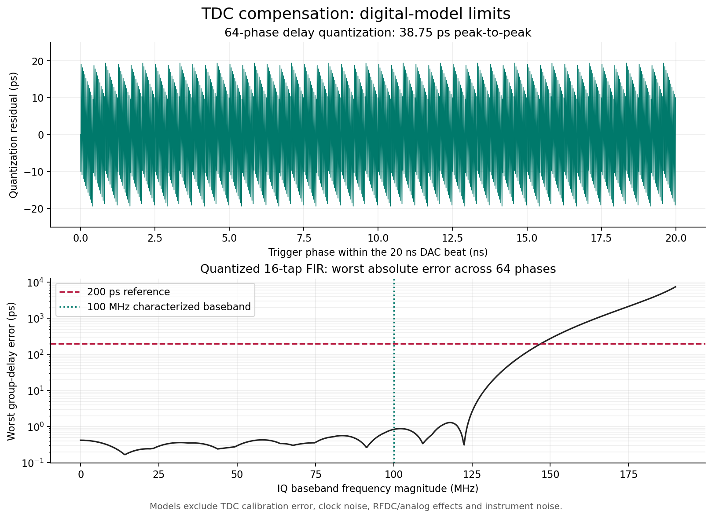

# 八通道 TDC 外触发补偿：评估与实施记录

> 研发归档：本文保留 2026-09-07 的 TDC 实施与交付证据。其中的
> `hardware_external_tdc_trigger_test` 入口已从当前仓库删除，命令不能直接运行。
> 当前板级测试流程见 [Slave 外部 Trigger 快速上手](../快速上手_方案B.md)。

日期：2026-09-07。远程项目：`kyu@10.87.5.16:/home/kyu/workspace/xczu47dr-rfdc-xs17-250mhz`。
起始提交：`7e5f889cbc4cecd545f62d10ed571b46be68c647`；起始工作区已有未提交 TDC 改动。

## 1. 目标与验收口径

- XS17 与外部 Trigger 共用 250 MHz 铷钟。Trigger 高电平为 32 ns，即 8 个参考周期。
- Trigger 分接至 XS19 和示波器 Trigger；板卡模拟输出接示波器。
- 原观测为 0、4、8、12、16 ns 五档延迟。目标是将 Trigger 到模拟波形时间位置的抖动压至 200 ps 以内。
- 本轮覆盖八路上传 IQ 数据，保持 400 MS/s 复数采样、每拍 8 个 IQ 样点、50 MHz AXIS、RFDC 16 倍插值及 6.4 GS/s。
- 用户暂未规定基带带宽。本轮量化报告明确有效频带；支持任意 IQ 数组并不等于在整个 Nyquist 频带内承诺相同误差。
- 同时记录延迟峰峰值和 RMS。200 ps 暂按更严格的峰峰目标考察，必须记录有效采集次数、触发遗漏、异常和测量条件。

## 2. 起始项目的实际进度

| 环节 | 起始证据与结论 |
|---|---|
| TDC 核心 | 已有 256 taps / 32 CARRY8、200 MHz 采样、编码和查表模块 |
| 校准 | Top 中写口全绑零，固定 30 ps/tap 初值不能当作物理校准 |
| 输出补偿 | TDC 仅进入 STATUS；实际播放仍由 50 MHz 捕获与固定周期调度启动 |
| 粗相位 | 自由运行的 2-bit 计数未明确对应原生 DAC 周期 |
| 物理约束 | 仅约束 carry；历史日志存在空对象和 XDC 不支持控制语句的问题 |
| 验证 | 旧 core 仿真强制内部码型和 slot，不能证明延迟链物理性能 |
| 构建 | 9 月 7 日综合成功；起始 artifacts 中三份 bit 的时间仍为 9 月 3 日 |
| 文档与示例 | 旧方案 B 的零抖动、0..7 槽及完成状态与当前代码不一致 |

旧 `build_slave.log` 中的多驱动失败发生于更早版本，不能据此断言最新综合失败。
起始源码已归档到 `work/tdc_20260907/baseline_sources.tar.gz`，起始综合 DCP 也已保留。

## 3. 方案合理性

参考沿间隔为 4 ns，DAC AXIS 周期为 20 ns，两者形成五个捕获相位。固定等待 K 个 DAC 周期只增加共同延迟，不会消除这五档量化误差。

TDC 适合测量亚周期到达时刻，但必须连接到可以调节波形时间位置的数据通路。6.4 GS/s 的 156.25 ps 输出采样周期，不能直接视作现有 PL 接口的可编程启动步进。

本轮实现的路径为：

`XS19 -> 带同位置采样 FF 的 CARRY8 链 -> 校准时间戳 -> 事件 FIFO -> 绝对周期调度 -> 八路整数样点移位 / 分数延迟 FIR -> 每事件 IQ 载波相位修正 -> RFDC`

时间戳以原生 50 MHz DAC 计数器为基准。DAC 下降沿发布参考标记，200 MHz 下降沿在半周期位置取样，随后以四个采样槽和校准细时间计算事件 epoch 与 0..20 ns 相位。

调度目标由采集时间戳确定，不使用事件 FIFO 到达时刻作为时间原点。公共相位转换为 2.5 ns 整数样点和 1/64 样点分数延迟，分数步进为 39.0625 ps。

RFDC NCO 的配置握手不适合逐事件包络移动。新增的数据侧复数旋转按各通道 NCO 频率消除事件相关的载波相位；同一 ARM 会话内维持参考，重新配置 RFDC 会建立新的固定相位关系。

## 4. 实现内容

| 文件 / 模块 | 职责 |
|---|---|
| `tdc_event_capture.v` | 2048 taps、256 CARRY8、2048 个采样 FF；局部单 bit 码型修复、流水编码、校准查表和事件时间戳 |
| `tdc_async_fifo.v` | 57-bit 完整事件跨域，处理 FIFO 复位忙状态 |
| `tdc_register_service.v` | DDR 到采样域的请求/应答，校准表读写、码密度统计、完整写入提交与 ARM 保护 |
| `tdc_compensating_trigger.v` | 基于事件 epoch 的调度，参数锁存、拒绝/超时/完成统计和故障状态 |
| `tdc_trigger_request_mux.v` | 保持 slave 的 SYNC/bypass 准入、支持软件 Trigger，抑制旧 HMC 路径的外部事件重复 |
| `iq_fractional_delay_8ppc.v` | 每路每拍 8 个 IQ 样点，0..7 样点移位和 16-tap FIR，18-bit Q2.16 系数 |
| `iq_event_phase_rotator.v` | 每通道事件相关 NCO 相位消除，14-bit 相位 ROM，定点舍入及饱和 |
| `Top.v` | 八路接入、FIFO 尾部排空、配置接收门控、时钟失锁处理和运行状态 |
| `network_config_pl.v` | DNA 读取器改为自身时钟域同步释放复位，时钟分频器持续运行 |
| `udp_waveform_ddr_writer.v` | 宽 FIFO 的存储写入独立为同步过程，推断 LUT RAM，降低 DDR 域写使能扇出 |
| `pl_riscv_control_v1.v` | 新增 RFCTRL2 opcode `0x11` 寄存器请求，完成后回复，具备超时 |
| `software/dr47/tdc.py` | 码密度质量检查、校准装载/回读/提交、补偿启用和诊断 |

输入暂停区间作为零样点处理，时间轴不会被压缩。最后原始字之后保留滤波尾部，待全部输出排空才允许下一配置生效。连续 loop 保留同一事件参数和滤波历史。

PREPARED 初次开放时拒绝此前的旧事件。等待超过 42.95 秒以及 32-bit 周期计数回绕的场景已有独立回归，避免长期等待后把新触发错误判断为过期。

补偿运行期间，FIFO 下溢、RFDC ready 丢失、时钟/校准失效会停止该事件并静音；不会把这些情况当作可延长时间轴的普通 AXIS 背压。满幅任意 IQ 可能在 FIR 或复数旋转后削顶，输出采用饱和并提供通道告警，不隐式缩放上传波形。

当前固定数字路径包含 32 个 DAC 周期的调度目标、播放门控、7 拍 FIR 接口流水线、3 拍相位旋转流水线及 FIR 的 7 样点基础群延迟。总模拟延迟还包括原记录内延迟和 RFDC 固定传播延迟；固定延迟不能与延迟抖动混淆。

## 5. 已完成的数字验证

| 检查 | 结果 |
|---|---|
| 全项目回归 | 360 项，359 项通过，1 项因 Vue 生产构建目录缺失而跳过；耗时 180.855 秒 |
| FIR 对独立 NumPy 整数卷积 | 18,360 拍、1,181 组；全部 64 x 8 相位/整数移位组合通过 |
| TDC 模型 | 五个 4 ns 档、采样/beat 边界、32 ns 脉冲、再触发、校准读回和非法码分类通过 |
| 寄存器跨域 | 应答时序、持续 valid 不重放、2048 项提交、读回和已 ARM 写保护通过 |
| 调度 | 扫描整个 20 ns 相位范围并改变事件传输延迟；数字时间跨度 38.75 ps |
| 载波旋转 | 正负 NCO 频率、八个并行样点、关闭修正的等增益路径、清除通过 |
| 协议 / 驱动 | TDC 请求、应答、超时、120-byte STATUS 和旧状态兼容专项通过 |

最终 FIR 系数采用 Kaiser beta=8.6，各相位 DC 系数和为 65536。下列误差来自最终量化系数，不是模拟板卡测量：

| IQ 基带范围 | 最大绝对群延迟误差 | 增益范围 |
|---|---:|---:|
| ±50 MHz | 0.420 ps | -0.001025..+0.000475 dB |
| ±100 MHz | 0.838 ps | -0.001115..+0.000556 dB |
| ±150 MHz | 274.450 ps | -0.297563..+0.000719 dB |
| ±180 MHz | 3079.660 ps | -4.799159..+0.000719 dB |

因此本版本不能把宽至 ±150 / ±180 MHz 的波形宣称为已经满足 200 ps。带宽今后确定时，必须据此增加滤波阶数或调整实现架构。



## 6. 构建记录

1024-tap 中间版本父层综合：零错误、零严重警告；LUT 128051 / 425280、FF 88285 / 850560、DSP 2378 / 4272、BRAM Tile 148 / 1080。该版本仅用于验证与物理评估，不能作为最终 bit 使用。

物理评估发现，1024-tap 的末端数据路径在快速工艺角下最短约 2.829 ns，不能可靠覆盖 5 ns 采样周期，因此最终扩展为 2048 taps。校准选择信号经过整条延迟链的路径属于异步测量入口，单独设置了到采样 D 引脚的时序例外，编码、查表和补偿等数字路径仍完整计时。报告还发现既有 DNA 读取域的复位 recovery/removal 问题，本轮增加本域同步释放并验证身份读取在不同复位相位下保持一致。

2048-tap 放置后快速角模型中，末端数据路径为 7.252 ns，首 tap 路径为 2.061 ns，相对跨度约 5.191 ns。这是静态模型证据，仍需上板码密度验证。所有 carry 与采样 FF 的 LOC/BEL 已经逐项核对。

全项目检查另外发现原有 10G Ethernet 缺少 156.25 MHz 参考时钟和部分 IP 跨时钟约束。新增 `restore_xxv_timing.tcl` 在参考 DCP 绑定后恢复厂商约束，并保持板卡实际的 GT 位置，避免通用 IP 约束把收发器移到其他管脚。最终验收增加无时钟寄存器检查；此前不完整时钟覆盖下的正裕量不作为最终交付依据。

完整时钟约束下的一次布局暴露了 FIFO 读侧复位问题：200 MHz 的复位释放直接参与 DAC 域 `rd_valid` 和补偿运算，形成只有 5 ns 预算的长组合路径，布局 WNS 为 -3.169 ns。读侧现改为 DAC 域三级同步释放，保留异步复位置位；只对同步器自身的 CLR 引脚设置例外，下游调度仍按 DAC 时钟计时。20 个复位释放相位的专项测试通过。

后续完整布线已消除上述复位路径问题，但暴露了 300 MHz UDP 写入队列的写使能路径，WNS 约 -0.5 ns。其单个使能驱动 320 个触发器，约 80% 路径延迟来自布线。存储数组写入现从异步复位的解析器过程独立为同步写入过程，沿用原 `push_write` 条件；指针、计数、入队/出队时刻和外部接口不变。综合确认地址队列使用 5 个 RAM32M16、数据队列使用 19 个 RAM32M16。新增测试覆盖 FIFO 满时同址出队/入队的旧数据语义、溢出丢弃、排空以及复位后禁止旧数据输出。

最终实现已完成并从同一个 post-route checkpoint 导出。custom_xczu47dr_slave 的 WNS 为 +0.018 ns、WHS 为 +0.004 ns；TIMING-17 无时钟寄存器检查为 0，34 条总线偏斜约束全部 `Slack (MET)`，bitstream DRC 无 Error，256 个 CARRY8 与 2048 个采样 FF 物理检查通过。bit SHA256 为 `470d85d486375da103d8d6b23e8153d9547f3073b8dd8ad37cbc794c117074da`，匹配 LTX SHA256 为 `4a087a2fe7470542d19ed421534471af96ccf7303e3ff26435800234f365c705`。交付目录为 `artifacts/tdc_20260907/`，原有三个正式 artifacts bit 未覆盖。

360 项回归中 359 项通过，1 项因 Vue 生产构建目录缺失而跳过；耗时 179.037 秒。`verification.json` 明确记录 `analog_jitter_verified=false`：200 ps 是数字实现和静态时序的目标，仍必须使用匹配 bit/LTX、板上校准和示波器完成模拟验收。

输出门槛：setup/hold slack 非负、全部时序约束满足、无未计时寄存器、跨域总线偏斜通过、布线完成、无阻断 DRC、256 个 carry 及 2048 个采样 FF 放置检查通过。SFP 的六个封装管脚和 GT 通道/COMMON 位置另行核对。最终导出从同一个 routed checkpoint 重新生成 bit、LTX 与报告，并记录三者 SHA256；打包时再次核对文件哈希。不会使用全局容许 -50 ps 的通过条件。

增量实现显式采用 `read_checkpoint -incremental -directive TimingClosure`，目标 WNS 为 0。Vivado 默认 `RuntimeOptimized` 会继承参考设计的 WNS；若参考仍有负裕量，不能把其默认优化目标用作本项目验收目标。

日志目录：`work/tdc_20260907/`。测试隔离环境：`work/tdc_20260907/venv/`。

跨域报告并非零告警。优化网表的结构检查包括稳定配置总线、保持数据的请求/应答总线、ILA/IP 内部路径及既有外触发异步置位锁存器等 Critical 项。TDC 寄存器数据保持到应答返回，以三级 toggle 同步器控制接收；NCO 数据在非 ARM 时更新、ARM 期间锁存，因此测试顺序必须先完成 RFDC 配置，再上传和 ARM。模式组合逻辑后的同步器也保留在报告中。最终交付包含原始 CDC 报告；DRC 无阻断项、数字回归通过不等于所有 CDC 结构告警已清零，更不替代板上长期可靠性测试。

## 7. 上板校准与测试

先烧写交付 bit，使用匹配 LTX。软件 `--bit` 参数记录的是用户已烧写的文件，并不能自行读取板上配置证明其一致。

```bash
cd /home/kyu/workspace/xczu47dr-rfdc-xs17-250mhz
export PYTHONPATH=software
work/tdc_20260907/venv/bin/python -m dr47.examples.hardware_external_tdc_trigger_test \
  --bit artifacts/tdc_20260907/custom_xczu47dr_slave.bit \
  --calibration artifacts/tdc_20260907/board_tdc_calibration.json \
  --calibrate-only

work/tdc_20260907/venv/bin/python -m dr47.examples.hardware_external_tdc_trigger_test \
  --bit artifacts/tdc_20260907/custom_xczu47dr_slave.bit \
  --calibration artifacts/tdc_20260907/board_tdc_calibration.json \
  --seconds 30
```

默认网络沿用用户自环脚本：`169.254.100.101:1234`、网卡 `enp1s0f0`、源 IP `169.254.250.11`，可由参数/环境变量覆盖。默认八路采用 500 MHz 载波、高斯记录；测试幅度为 0.5，保留滤波余量。用户原脚本默认幅度为 1.0。

- `--baseline` 用同一记录关闭补偿做对照。
- `--waveforms file.npz` 接受 `ch1..ch8` 的交错 int16 IQ 数组。
- `--nco-ghz` 后跟八个值，可用不同载波测试，例如 `0.5 0.6 0.175 0.325 0.5 0.6 0.175 0.325`。
- 校准由独立 PS 时钟激励，要求至少 262144 个有效样本、至少 64 个有效 bin、最大码密度 bin 不超过 100 ps、无溢出、非法码比例不超过 1%。不满足条件时禁止将该数据当作合格校准。
- 校准文件绑定板卡 UID 与 bit 文件 SHA256。修改布局布线、重新生成 bit 或明显温度变化后重新校准。
- 新脚本上传/ARM 一次，不发送 EMIT，不因自动预取的瞬态状态而中止重装；退出时发送 ABORT_MUTE。
- 外部 Trigger 间隔需要大于记录播放及预取时间。初次测试可用 25001 个参考周期，即 100.004 微秒；这个周期不是 20 ns 的整数倍，可逐次扫过五个 4 ns 相位。
- 原 `hardware_slave_xs18_loopback_trigger_test` 仅保留为自环诊断；它的循环次数不等于外部触发次数，旧 ILA 延迟脚本的 DAC 周期计数也不能验收 200 ps。

## 8. 寄存器摘要

请求 `0x11` payload 为四个小端 u32：`write, address, data, reserved=0`；应答 payload 为两个小端 u32：`address, data`。写操作不自动重发。

| 地址 | 含义 |
|---|---|
| `0x0000` | 标识 `0x54444301` |
| `0x0004` | 控制：bit0 补偿、bit1 校准激励、bit2 载波相位修正；校准激励与补偿互斥 |
| `0x0008` | 状态：bit0 参考就绪、bit1 校准有效、bit2 补偿开、bit3 校准激励、bit4 清表中、bit5 已 ARM |
| `0x000C` | 有符号公共相位偏置，单位 10 ps |
| `0x0010..0x002C` | 采集/非法码/溢出计数、完整 11-bit tap、最近时间戳、直方图总数 |
| `0x0030..0x004C` | 实际接受/完成/拒绝/超时、故障、削顶通道、事件状态及延迟码 |
| `0x0050 / 0x0054` | 完整写入项数 / 校准修订号 |
| `0x0058` | 命令：1 清统计/直方图；2 提交完整表；4 使校准失效 |
| `0x005C` | 几何信息：2048 taps、16 taps FIR、64 分数档 |
| `0x1000..0x2FFC` | 2048 个校准表项，低 16 bit，10 ps 单位，按地址顺序写入并读回 |
| `0x4000..0x5FFC` | 2048 个 32-bit 码密度计数 |

普通 STATUS 中旧 8-bit tap 字段保留兼容，完整 tap 和时间戳应使用新 CSR。统计是运行快照；对照总数应在停止采集后读取。

## 9. 尚需物理验收的内容

没有在本任务中烧写 FPGA、采集示波器或验证板上 200 ps。因此数字模型、综合和 bit 生成均不能替代以下检查：

1. 记录 bit/LTX/校准 SHA256、板号、温度、时钟锁定和外部触发周期。
2. 五个 4 ns 相位都要被覆盖；八路分别采集足够多的正常事件，同时报告遗漏与故障数量。
3. 比较同一波形的时间平移，优先用完整波形互相关或拟合；同时观察包络与载波，不能只用慢包络单点阈值的余辉宽度判断。
4. 检查不同 NCO 频率下的载波修正方向及相位稳定性，测量链自身的触发噪声、采样率和幅度噪声也必须记录。
5. 检查 PVT、码密度线性度、非法码率和延迟链覆盖范围。当前仿真延迟模型不代表 XCZU47DR 的真实 tap 延迟。

本记录替代旧方案 B 文档中未经验证的“零抖动”完成表述。
